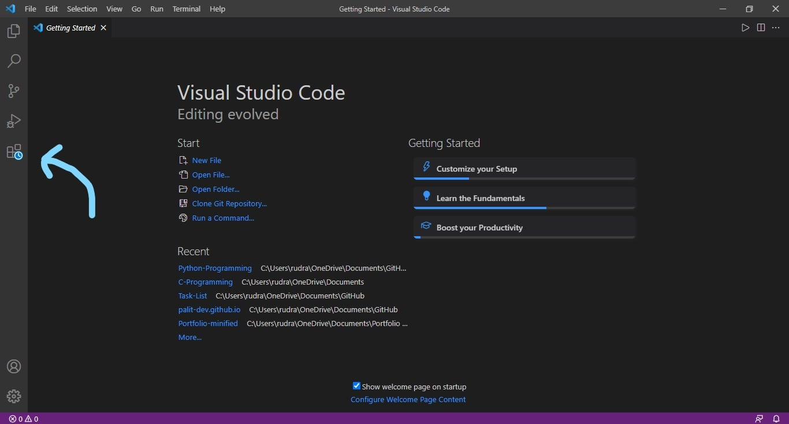

# **Setting Up Python Local Environment**
Welcome! Setting up a Local Environment for any Programming Language is pretty cumbersome. This tutorial provides a set by step guide on how to get Python up and running to begin our journey together.

**What you'll Learn**
1. Installing Python Interpreter.
2. Setting Up Python Interpreter for Windows.
3. Installing Visual Studio Code Editor.
4. Setting Up VS Code for Python.
5. Using Code Runner

## **1. Installing Python Interpreter**
Proceed to [Python Official Website](https://www.python.org/downloads/) to download the latest version of Python for your System. The version of Python may or may not be same as shown in the following image.


Download the Python setup and run the .exe file. Choose default configurations and install. If given an option to add Python to path, click the checkbox.

## **2. Setting Up Python for Windows**
Whenever an Interpreter/Compiler is installed in a Windows, we must inform the OS about it. Logically it should be done internally but since Windows is not a Linux, it fails.

### 2.1 Checking
Thus, we will first check whether the OS has been alerted. To do this, go to `Start`, type *cmd* and then press **Enter**. This should open the terminal. Within the terminal, type the following command and press **Enter**.

```bash
python --version & pip --version
```

This should produce outputs similar to the following:


If any of the `Python` or `pip` outputs are missing. Proceed forward otherwise skip to next chapter.

### 2.2 Rectifying
Go to `Start`, type `Environment Variables` and hit **Enter**. Proceed to `Environment Variables`. 


Go to the System Variables section. (Not User Variables). Double click on `Path`. Click on the **New** button and add the following two paths one after another.

```bash
C:\Users\<username>\AppData\Local\Programs\Python\Python39\Scripts
C:\Users\<username>\AppData\Local\Programs\Python\Python39
```

Restart the Computer and use the method provided in the **Checking** subsection to ensure all done properly. Better Safe than Sorry. 


## **3. Installing Visual Studio Code**
Proceed to [Visual Studio Code Website](https://code.visualstudio.com/) and download the latest version compatible with your System. The Website may wary depending upon the time it is visited.


Download the setup and install the .exe with the default configuration.

## **4. Seting Up VS Code for Python**
Open VS Code and click on the Plugins button on the left hand panel.



Search Python in the search bar and look for the [Python Extension](https://marketplace.visualstudio.com/items?itemName=ms-python.python) developed by Microsoft. Click on the tiny install button at the bottom right corner.


## **5. Setting Up Code Runner**
In the same manner install another plugin `Code Runner` that will help to exceute the code. On installing this plugin, a play button will appear on the right hand side top corner. Always use the *run Python File in Terminal* option for accurate outputs.


## **Finishing Up**
Voila! Your Python setup is complete. Now it's time to write your first Code which as per customary of the Dev Society will be Hello World

Create a Folder for all your Python Programs. Let it be `C:\Users\rudra\OneDrive\Documents\Python`

Open the Folder, right click and select `Open with Code`.
The Folder will open in VS Code. 

Click on the `add file` button and name it `test.py`

Add the following code snippet

```python
print("Hello World")
```
Press the play button in the top right corner. If you see the message `Hello World` in the console, Congrats you have successfully set up a Local Environment for PyDev.

<br />
<br />


<br />

**Rudra Nath Palit**

