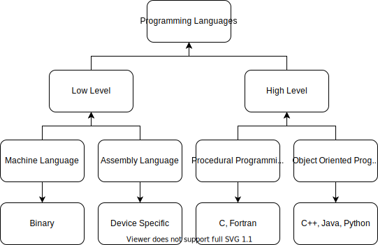

# An Overview to Programming Languages

## Programming Languages
Programming Languages are a set of statements that can be translated into a set of instructions understandable to the computer.

## Operation of Programming Language

A Computer is an electrical machine and hence, it cannot directly process the language of Humans. The only language that the Computer comprehends are electrical signals. Hence, there is a need of a middle agent that can convert Programming Languages to a representation of electric pulses, which is performed by the Translator. We will learn more about Translator in a later section. 

    

### Instructions
Instructions refers to the byte code obtained after the translation of a Programming Language into its binary format.

The 1s and 0s in the binary format resembles the voltage levels. However, care must be taken not to confuse the 1s and 0s with 1V and 0V respectively. In fact, many resources use 1s and 5V interchangebly. This is wrong, eventhough its common but its not mandatory.

There are several parts of a Computer that in fact can operate at a different voltage level such as the BIOS that operates at 3.3 V.

So the question arises, what does the 1s and 0s refers to? The answer, as it appears is quite simple. **1** is any voltage level higher than the threshold voltage of the transistors used in the processor and similarly the **0** refers to any voltage lower than the threshold.

### Statements
Statements are the *special* language that consists of a strict grammar or set of rules, used by the Programmer to solve a problem of interest. The strict rules allows a one to one mapping of the words with a binary code understandable to the Computer. 

In fact the absence of this strictness in our daily language, fails to provide the one-one mapping during translation and, is is the main reason as to why it cannot be used for programming.

A Statement can be classified as High Level or Low Level depending on proximity of the Language with *English*. Hence, a high level language such as Python can become quite intuitive making programming easy. 

However, at the same time one must understand that the closer the language is to *English* the looser is its Grammar and the more difficult it is to translate. Thus, higher level language often exhibit lower efficiency in terms of Speed of Execution than Lower Languages such as `C`. 

    

### Translator
In Programming Languages, there are three kinds of Translators:

    

1. **Assembler:** It converts the Assembly Level Language to Machine Language. These assemblers are device specific in the sense that the Assemblers differ as per the specification of the Processor set and its manufacturing Company.

2. **Compiler:** It converts a high level language to Machine Language all in one go and produces an Object Code. This object code can then be excuted to *see* the Output of the Program.

3. **Interpreter:** It converts a high level language to Machine Language line by line. However, it does not create any object code and hence, an interpreter-based Language such as Python needs to be interpreted every time before execution.

 
 

 

**Rudra Nath Palit**